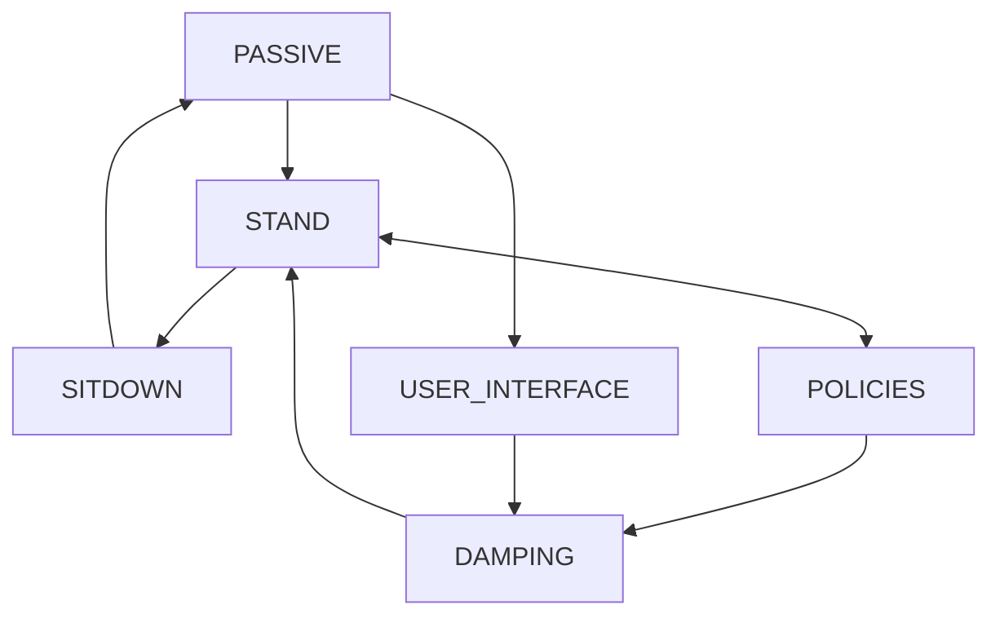

### Introduction
This is a simple project based on Mujoco Simulator/Gazebo Simulator and ROS.

### Installation
First, setup the enviroment.
* Denpendencies
  * Eigen 3.4.0
  * LCM 1.5.0
  * libusb
  * iceoryx: https://github.com/eclipse-iceoryx/iceoryx/tree/main

* Libraries
```bash
sudo apt-get install libglfw3-dev libboost-all-dev
```
* Setup the GCC-11
```bash
sudo add-apt-repository ppa:ubuntu-toolchain-r/test
sudo apt-get install libgl1-mesa-dev libxinerama-dev libxcursor-dev libxrandr-dev libxi-dev ninja-build
sudo apt update
sudo apt-get install gcc-11 g++-11
sudo update-alternatives --install /usr/bin/gcc gcc /usr/bin/gcc-11 60 --slave /usr/bin/g++ g++ /usr/bin/g++-11 
```
* Download onnx:
```bash
# Download the C++ library (adjust version as needed)
wget https://github.com/microsoft/onnxruntime/releases/download/v1.16.1/onnxruntime-linux-x64-1.16.1.tgz
tar -xvzf onnxruntime-linux-x64-1.16.1.tgz
```
rename `onnxruntime-linux-x64-1.16.1` to `onnxruntime-linux-x64-1-16-1`
---
### Build the Project
```bash
mkdir build && cd build
# if you want to run on real robot
# the cmake will show (Real_Robot build exclude iceoryx)
cmake -DREAL_ROBOT=true -DGAME_STAR=true .. # choose your rc, Logic or Gaishi Chicken
# the cmake will show (Simulator build include iceoryx)
cmake .. # just for simulation
make -jn
```
### Running the project
#### Remote FSM:
##### LOGIC REMOTE CONTROLLER
* LB + A = STAND
* LB + X = RL WALK
* LB + Y = PASSIVE
* LB + B = WeiPeng's Policy
* LB + Logitech = SITDOWN
* LB + START = USER_INTERFACE.
##### Gaishi Chicken Remote Controller
* LB + A = STAND
* LB + Y = RL WALK
* LB + X = SITDOWN
* LB + B = WeiPeng's Policy
* LB + RB = DAMPING
* RB + X = PASSIVE
* LB + RO (the small right-top button) = USER_INTERFACE.



#### Run the Project
*Simulate your controller in Mujoco Simulator*
```angular2html
sudo iox-roudi
bash ./scripts/launch_sim_mj.sh # in a new terminal
bash ./scripts/launch_sim_ctrl.sh # in a new terminal
```
Watch the data in the lcm channel.
```bash
bash ./scripts/launch_lcm.sh
```
Send bin to the slave
```bash
bash ./scripts/send_to_slave.sh #TODO: test this script
```


